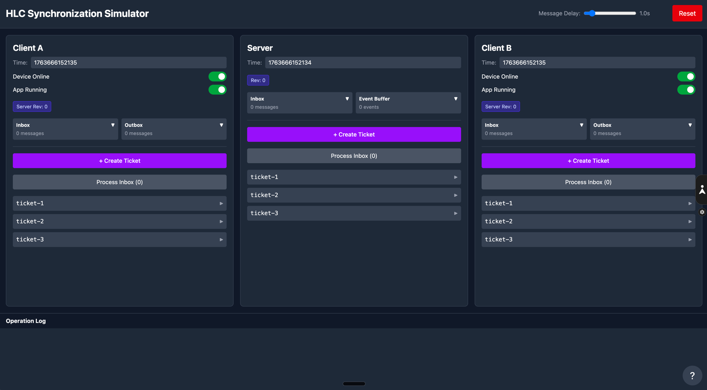

# HLC Synchronization Simulator

A visual, interactive simulator for understanding Hybrid Logical Clock (HLC) synchronization in distributed systems. This educational tool demonstrates how HLC maintains causal consistency across multiple clients and a central server, with real-time visualization of message passing and clock synchronization.



## Overview

The HLC Synchronization Simulator provides a hands-on way to explore distributed system concepts, specifically focusing on:
- **Hybrid Logical Clocks**: Combining physical timestamps with logical counters
- **Causal Consistency**: Maintaining event ordering across distributed nodes
- **Message Synchronization**: Visual representation of client-server communication
- **Conflict Resolution**: Understanding how HLC helps resolve concurrent operations

## Features

### Core Functionality
- **Three-Node Architecture**: Two clients (A & B) communicating through a central server
- **Real-time Clock Visualization**: Watch HLC timestamps update across nodes
- **Interactive Ticket System**: Create and sync tickets between clients
- **Message Queue Management**: Inbox/Outbox visualization with processing controls
- **Network Delay Simulation**: Adjustable message delay (0.5-3 seconds) to simulate network latency
- **Operation Logging**: Detailed log of all system operations and state changes

### Visual Components
- **Node Status Indicators**: Device online/offline and app running states
- **Message Flow Animation**: Visual representation of messages traveling between nodes
- **Ticket Tree Visualization**: Hierarchical view of ticket relationships
- **Event Buffer Display**: Server-side event accumulation and processing

### Educational Features
- **Step-by-Step Processing**: Manual control over message processing
- **Reset Capability**: Start fresh scenarios to test different patterns
- **Detailed Logging**: Understand the internal mechanics of HLC synchronization

## Tech Stack

- **Frontend Framework**: React 19 with TypeScript
- **Build Tool**: Vite 6
- **State Management**: Zustand
- **Styling**: Tailwind CSS
- **Clock Implementation**: Custom HLC implementation
- **Unique IDs**: UUID library

## Installation

### Prerequisites
- Node.js 18+ and npm/yarn
- Git

### Setup Steps

1. Clone the repository:
```bash
git clone <repository-url>
cd hlc_test3
```

2. Install dependencies:
```bash
npm install
# or
yarn install
```

3. Start the development server:
```bash
npm run dev
# or
yarn dev
```

4. Open your browser and navigate to `http://localhost:5173`

## Usage Guide

### Basic Operations

1. **Creating Tickets**:
   - Click "+ Create Ticket" on either Client A or Client B
   - The ticket is created locally with an HLC timestamp
   - The ticket is automatically queued in the Outbox for synchronization

2. **Processing Messages**:
   - Click "Process Inbox" to handle incoming messages
   - Messages are processed in FIFO order
   - HLC timestamps are updated based on received messages

3. **Adjusting Network Delay**:
   - Use the slider at the top to simulate network latency (0.5-3 seconds)
   - Watch how delays affect message ordering and clock synchronization

4. **Monitoring State**:
   - Check the Operation Log for detailed system behavior
   - Observe Server Rev counters to track synchronization versions
   - Monitor Inbox/Outbox counts for pending operations

### Advanced Scenarios

#### Concurrent Operations
1. Create tickets on both clients simultaneously
2. Observe how HLC timestamps maintain causal ordering
3. Process messages to see conflict resolution

#### Network Partitions
1. Toggle "Device Online" status to simulate disconnections
2. Create tickets while offline
3. Reconnect and observe synchronization behavior

#### Clock Drift Simulation
1. Create rapid successive tickets on one client
2. Switch to another client and create tickets
3. Observe how logical counters handle clock drift

## Architecture

### Component Structure

```
src/
├── components/
│   ├── NodeView.tsx        # Client/Server node UI
│   ├── MessageCanvas.tsx   # Message flow visualization
│   ├── LogPanel.tsx        # Operation log display
│   ├── TicketTree.tsx      # Ticket hierarchy view
│   └── HelpOverlay.tsx     # Help documentation
├── store/
│   └── simulatorStore.ts   # Zustand state management
├── utils/
│   ├── hlc.ts             # HLC implementation
│   └── merge.ts           # Merge logic for tickets
├── types.ts               # TypeScript type definitions
└── App.tsx                # Main application component
```

### HLC Implementation

The Hybrid Logical Clock combines:
- **Physical Time**: Current system timestamp
- **Logical Counter**: Increments when events occur at the same physical time
- **Node ID**: Unique identifier for tie-breaking

Format: `{physical_time}.{logical_counter}.{node_id}`

### Message Flow

1. **Client → Server**: Tickets created locally are sent to server
2. **Server Processing**: Server updates its HLC and broadcasts to other clients
3. **Server → Client**: Other clients receive updates and merge into local state
4. **Clock Synchronization**: Each node updates its clock based on received messages

## Development

### Build for Production
```bash
npm run build
# Output in dist/ directory
```

### Run Tests
```bash
npm run test
```

### Linting
```bash
npm run lint
```

## Educational Value

This simulator is designed for:
- **Computer Science Students**: Understanding distributed systems concepts
- **Software Engineers**: Learning about clock synchronization protocols
- **System Designers**: Visualizing causality in distributed architectures
- **Educators**: Teaching tool for distributed systems courses

## Key Concepts Demonstrated

- **Causality**: Events maintain proper ordering across distributed nodes
- **Eventual Consistency**: All nodes converge to the same state
- **Vector Clocks vs HLC**: Understanding the benefits of hybrid approaches
- **Lamport Timestamps**: Foundation of logical clock algorithms
- **CAP Theorem**: Trade-offs in distributed system design

## Contributing

Contributions are welcome! Please feel free to submit pull requests or open issues for:
- Bug fixes
- New features
- Documentation improvements
- Educational scenarios

## License

MIT License - See LICENSE file for details

## Acknowledgments

- Based on the Hybrid Logical Clock paper by Sandeep Kulkarni, Murat Demirbas, et al.
- Inspired by distributed systems research and educational needs
- Built with modern web technologies for accessibility and ease of use

## Resources

- [Original HLC Paper](https://cse.buffalo.edu/tech-reports/2014-04.pdf)
- [Lamport Timestamps](https://en.wikipedia.org/wiki/Lamport_timestamp)
- [Vector Clocks](https://en.wikipedia.org/wiki/Vector_clock)
- [CAP Theorem](https://en.wikipedia.org/wiki/CAP_theorem)

## Support

For questions, issues, or suggestions, please open an issue on GitHub or contact the maintainers.

---

**Note**: This is an educational tool designed to help understand distributed systems concepts. It simulates network behavior and is not intended for production use.